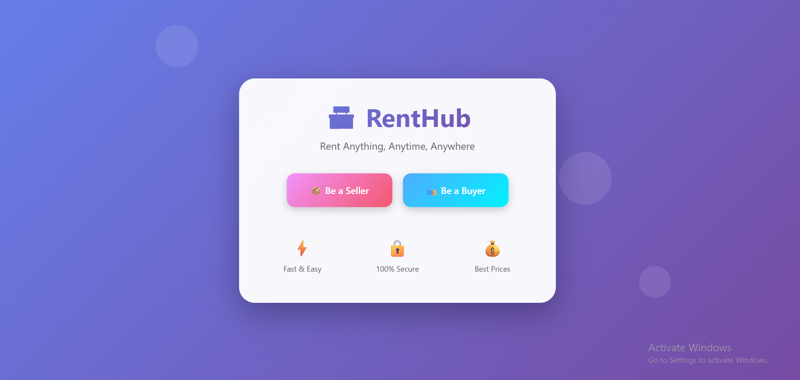
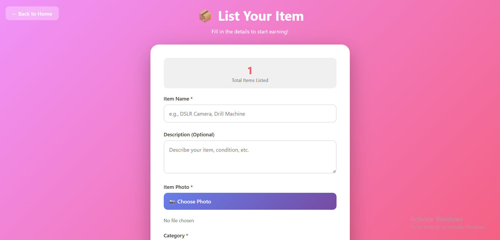
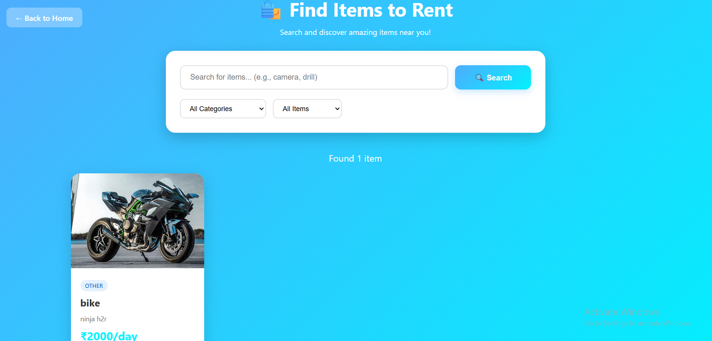

# 🏪 RentHub - Peer-to-Peer Rental Marketplace

A full-stack web application that enables users to list and rent items within their local community, promoting sustainable sharing economy practices.

## 📋 Table of Contents

- [Features](#features)
- [Tech Stack](#tech-stack)
- [Installation](#installation)
- [Usage](#usage)
- [API Endpoints](#api-endpoints)
- [Screenshots](#screenshots)
- [Future Enhancements](#future-enhancements)
- [Contributing](#contributing)
- [License](#license)

## ✨ Features

- **Seller Portal**: List items with images, descriptions, categories, and pricing
- **Buyer Portal**: Browse, search, and filter available items
- **Advanced Search**: Search by name, category, and availability status
- **Automated Billing**: Generate rental bills with security deposit calculation
- **Cloud Database**: Real-time data synchronization using MongoDB Atlas
- **Image Upload**: Support for item images with Base64 encoding
- **Responsive Design**: Mobile-friendly interface with smooth animations
- **RESTful API**: Complete backend API for CRUD operations

## 🛠️ Tech Stack

### Frontend
- HTML5, CSS3 (Flexbox, Grid, Animations)
- Vanilla JavaScript (ES6+)
- Fetch API for async operations

### Backend
- Node.js (v20+)
- Express.js
- Mongoose (MongoDB ODM)

### Database
- MongoDB Atlas (Cloud NoSQL Database)

### Other Tools
- CORS (Cross-Origin Resource Sharing)
- Multer (File handling)
- dotenv (Environment variables)

## 📦 Installation

### Prerequisites
- Node.js (v20 or higher)
- npm (Node Package Manager)
- MongoDB Atlas account (free tier)

### Steps

1. **Clone the repository**
    git clone https://github.com/YOUR_USERNAME/renthub.git
cd renthub

text

2. **Install dependencies**
npm install

text

3. **Set up environment variables**

Create a `.env` file in the root directory:
MONGODB_URI=your_mongodb_connection_string
PORT=5000

4. **Start the server**
npm start

text

5. **Open in browser**
http://localhost:5000

## 🚀 Usage

### For Sellers
1. Navigate to the home page
2. Click "Be a Seller"
3. Fill in item details (name, description, category, price)
4. Upload an item photo
5. Submit to list your item

### For Buyers
1. Navigate to the home page
2. Click "Be a Buyer"
3. Browse available items
4. Use search and filters to find specific items
5. Click "Generate Bill" to see rental costs

## 🔌 API Endpoints

| Method | Endpoint | Description |
|--------|----------|-------------|
| GET | `/api/items` | Fetch all items |
| GET | `/api/items/:id` | Fetch single item by ID |
| POST | `/api/items` | Create new item |
| PUT | `/api/items/:id` | Update item by ID |
| DELETE | `/api/items/:id` | Delete item by ID |
| GET | `/api/items/search/:query` | Search items by name/description |
| GET | `/api/health` | Health check endpoint |

### Example Request (Create Item)

POST /api/items
Content-Type: application/json

{
"name": "DSLR Camera",
"description": "Canon EOS with 18-55mm lens",
"category": "photography",
"availability": "available",
"price": 800,
"photo": "data:image/jpeg;base64,..."
}

text

### Example Response
{
 "success": true,
"message": "Item created successfully",
"data": {
"_id": "674c9f8e7a1b2c3d4e5f6789",
"name": "DSLR Camera",
"price": 800,
...
}
}

## 📸 Screenshots

### Home Page

### Seller Portal

### Buyer Portal

*Note: Add actual screenshots to a `screenshots` folder in your repository*

## 🎯 Future Enhancements

- [ ] User authentication (JWT)
- [ ] Payment gateway integration (Razorpay/Stripe)
- [ ] User profiles and item ownership
- [ ] Edit/Delete item functionality in frontend
- [ ] Real-time chat between users
- [ ] Order management system
- [ ] Reviews and ratings
- [ ] Email notifications
- [ ] Cloud image storage (AWS S3/Cloudinary)
- [ ] Mobile app (React Native/Flutter)
- [ ] Admin dashboard

## 📁 Project Structure

renthub/
├── public/
│ ├── index.html # Landing page
│ ├── seller.html # Seller interface
│ └── buyer.html # Buyer interface
├── node_modules/ # Dependencies (not in git)
├── server.js # Express server & API routes
├── package.json # Project metadata
├── .env # Environment variables (not in git)
├── .gitignore # Git ignore rules
└── README.md # Project documentation

## 🤝 Contributing

Contributions are welcome! Please follow these steps:

1. Fork the repository
2. Create a new branch (`git checkout -b feature/amazing-feature`)
3. Commit your changes (`git commit -m 'Add some amazing feature'`)
4. Push to the branch (`git push origin feature/amazing-feature`)
5. Open a Pull Request

## 📄 License

This project is licensed under the MIT License - see the [LICENSE](LICENSE) file for details.

## 👨‍💻 Author

**Your Name**
- GitHub: [@YOUR_USERNAME](https://github.com/YOUR_USERNAME)
- LinkedIn: [Your LinkedIn](https://linkedin.com/in/YOUR_PROFILE)
- Email: your.email@example.com

## 🙏 Acknowledgments

- MongoDB Atlas for cloud database hosting
- Express.js community for excellent documentation
- All open-source contributors

---

⭐ If you found this project helpful, please give it a star!

**Built with ❤️ for the sharing economy**
